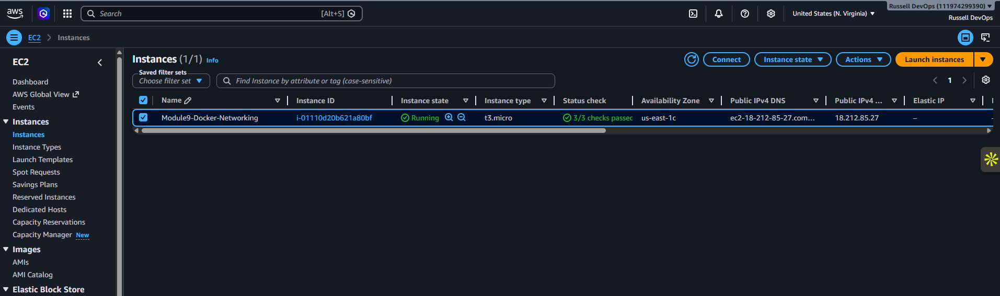
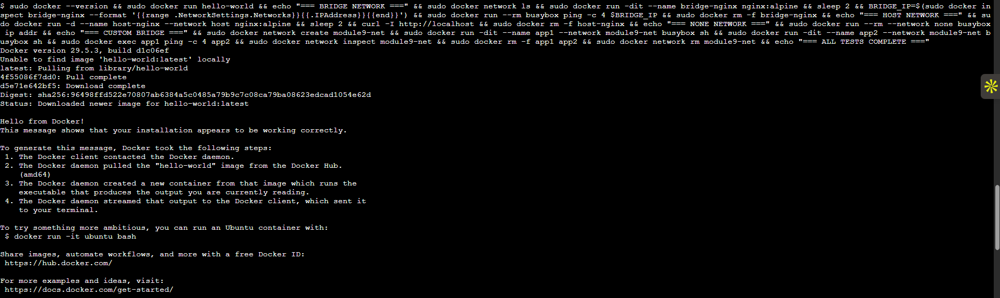
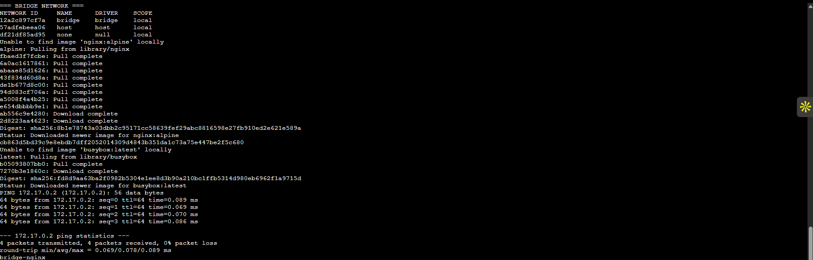
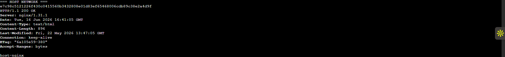
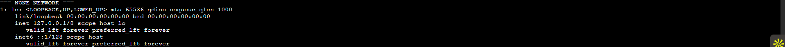
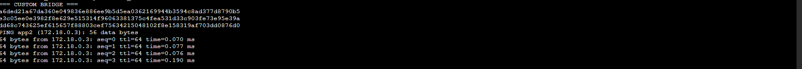

# Module 9 Assignment: Docker Installation and Networking on AWS EC2

This lab documents Docker installation on an AWS EC2 instance, Docker permissions for a non-root user, successful container deployment, and practical tests for Docker bridge, host, none, and custom bridge networks.

## Environment

- Cloud provider: AWS
- Compute: EC2 instance
- Operating system: Ubuntu Server 22.04 LTS or later
- SSH user: `ubuntu`
- Docker package source: Official Docker APT repository

**Your instance details:**

- EC2 public IP: `18.212.85.27`
- Instance ID: `i-01110d20b621a80bf`
- Key pair file: `module9-docker-networking.pem`
- GitHub repository: `https://github.com/username/module9-docker-networking`

## Screenshot Checklist

Save screenshots in the `screenshots/` folder using these filenames:

- `01-ec2-instance.png` - EC2 instance running in the AWS console
- `02-docker-version.png` - Docker installed and version verified
- `03-user-docker-group.png` - non-root user added to the Docker group
- `04-hello-world.png` - `hello-world` container output
- `05-bridge-network.png` - default bridge network test
- `06-host-network.png` - host network test
- `07-none-network.png` - none network test
- `08-custom-bridge-network.png` - custom bridge network test

## 1. Connect to the EC2 Instance

From the local machine:

```bash
chmod 400 module9-docker-networking.pem
ssh -i module9-docker-networking.pem ubuntu@18.212.85.27
```

Observation:

The SSH connection opened a terminal session on the EC2 instance as the `ubuntu` user.

Screenshot evidence:



## 2. Install Docker

Update package indexes and install prerequisites:

```bash
sudo apt-get update
sudo apt-get install -y ca-certificates curl gnupg
```

Add Docker's official GPG key:

```bash
sudo install -m 0755 -d /etc/apt/keyrings
curl -fsSL https://download.docker.com/linux/ubuntu/gpg | sudo gpg --dearmor -o /etc/apt/keyrings/docker.gpg
sudo chmod a+r /etc/apt/keyrings/docker.gpg
```

Add the Docker APT repository:

```bash
echo \
  "deb [arch=$(dpkg --print-architecture) signed-by=/etc/apt/keyrings/docker.gpg] https://download.docker.com/linux/ubuntu \
  $(. /etc/os-release && echo "$VERSION_CODENAME") stable" | \
  sudo tee /etc/apt/sources.list.d/docker.list > /dev/null
```

Install Docker Engine:

```bash
sudo apt-get update
sudo apt-get install -y docker-ce docker-ce-cli containerd.io docker-buildx-plugin docker-compose-plugin
```

Verify Docker is installed:

```bash
sudo docker --version
sudo systemctl status docker --no-pager
```

Expected result:

Docker is installed, the Docker service is active, and the Docker version command returns the installed version.

Screenshot evidence:


## 3. Configure Docker Permissions for a Non-Root User

Add the `ubuntu` user to the `docker` group:

```bash
sudo usermod -aG docker ubuntu
```

Apply the group change:

```bash
newgrp docker
```

Verify the user can run Docker without `sudo`:

```bash
groups
docker ps
```

Expected result:

The `groups` command includes `docker`, and `docker ps` runs without a permission error.

Screenshot evidence:


## 4. Run the Hello World Container

Run Docker's test image:

```bash
docker run hello-world
```

Expected result:

Docker pulls the `hello-world` image and prints a message confirming that the installation is working correctly.

Observation:

The container executed successfully, proving that Docker can pull images from Docker Hub and run containers on the EC2 instance.

Screenshot evidence:



## 5. Docker Network Types

Docker networking controls how containers communicate with each other, the host, and external networks.

### Bridge Network

The bridge network is Docker's default network for standalone containers. Containers connected to the default bridge can reach external networks through NAT. Container-to-container communication is possible by IP address, but automatic DNS name resolution is limited on the default bridge.

Lab commands:

```bash
docker network ls
docker network inspect bridge
docker run -dit --name bridge-nginx nginx:alpine
BRIDGE_NGINX_IP=$(docker inspect bridge-nginx --format '{{range .NetworkSettings.Networks}}{{.IPAddress}}{{end}}')
docker run --rm busybox ping -c 4 $BRIDGE_NGINX_IP
docker rm -f bridge-nginx
```

Expected result:

The `bridge-nginx` container receives an IP address on Docker's default bridge network, and another container can ping it by IP address.

Observation:

The bridge network provided private container networking through Docker's default bridge interface.

Screenshot evidence:



### Host Network

The host network removes Docker's network isolation and lets the container share the EC2 instance's network namespace. The container does not receive a separate container IP address.

Lab commands:

```bash
docker run -d --name host-nginx --network host nginx:alpine
curl -I http://localhost
docker inspect host-nginx --format '{{json .NetworkSettings.Networks}}'
docker rm -f host-nginx
```

Expected result:

Nginx responds on the host's `localhost` interface, and Docker inspection shows that the container is attached to the host network.

Observation:

The host network allowed the containerized web server to bind directly to the EC2 instance network stack.

Screenshot evidence:



### None Network

The none network disables external networking for the container. Docker still creates a loopback interface inside the container, but no external network interface is attached.

Lab commands:

```bash
docker run --rm --network none busybox ip addr
docker run --rm --network none busybox ping -c 4 8.8.8.8
```

Expected result:

The `ip addr` command only shows the loopback interface, and the ping command fails because the container has no external network access.

Observation:

The none network isolated the container from external network communication.

Screenshot evidence:



### Custom Bridge Network

A custom bridge network is user-defined and provides better container-to-container communication than the default bridge. Containers on the same custom bridge can resolve each other by container name using Docker's built-in DNS.

Lab commands:

```bash
docker network create module9-net
docker network ls
docker run -dit --name app1 --network module9-net busybox sh
docker run -dit --name app2 --network module9-net busybox sh
docker exec app1 ping -c 4 app2
docker network inspect module9-net
docker rm -f app1 app2
docker network rm module9-net
```

Expected result:

The `app1` container successfully pings `app2` by container name.

Observation:

The custom bridge network enabled container DNS name resolution and isolated the lab containers from unrelated containers.

Screenshot evidence:



## 6. Cleanup

Run these commands to remove any containers and networks left over from testing:

```bash
docker rm -f bridge-nginx host-nginx app1 app2 2>/dev/null || true
docker network rm module9-net 2>/dev/null || true
docker system prune -f
```

## Results Summary

| Task | Result |
| --- | --- |
| Docker installed on EC2 | Completed |
| Non-root Docker permissions configured | Completed |
| `hello-world` image executed | Completed |
| Bridge network demonstrated | Completed |
| Host network demonstrated | Completed |
| None network demonstrated | Completed |
| Custom bridge network demonstrated | Completed |

## Commands Used

The main commands used during this lab were:

```bash
sudo apt-get update
sudo apt-get install -y ca-certificates curl gnupg
sudo install -m 0755 -d /etc/apt/keyrings
curl -fsSL https://download.docker.com/linux/ubuntu/gpg | sudo gpg --dearmor -o /etc/apt/keyrings/docker.gpg
sudo chmod a+r /etc/apt/keyrings/docker.gpg
sudo apt-get install -y docker-ce docker-ce-cli containerd.io docker-buildx-plugin docker-compose-plugin
sudo usermod -aG docker ubuntu
newgrp docker
docker --version
docker ps
docker run hello-world
docker network ls
docker network inspect bridge
docker run -dit --name bridge-nginx nginx:alpine
docker run -d --name host-nginx --network host nginx:alpine
docker run --rm --network none busybox ip addr
docker network create module9-net
docker run -dit --name app1 --network module9-net busybox sh
docker run -dit --name app2 --network module9-net busybox sh
docker exec app1 ping -c 4 app2
docker network rm module9-net
```
